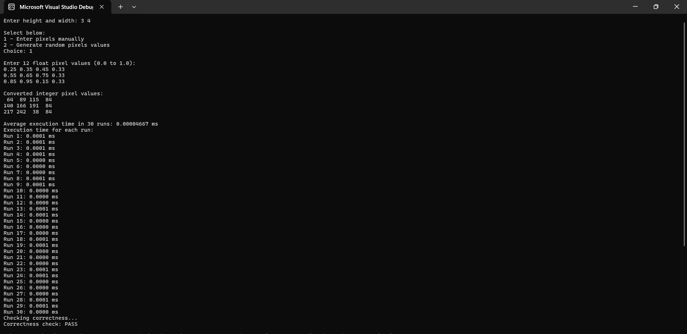

# x86-to-C Interface Programming Project

Task: Implement a program that converts a grayscale image from float-based representation to integer-based representation using C and x86-64 assembly language.

---

## Input

* `height` (number of rows)
* `width` (number of columns)
* Float pixel values of the grayscale image

## Output

* Integer pixel values (0–255) corresponding to the float values scaled appropriately

---

## Run Program

1. Make sure `build.bat` is in the same directory as the source files.
2. Open **Command Prompt**, navigate to the project folder.
3. Execute the batch file:

   ```cmd
   build.bat
   ```
---

## Recorded Execution Times

Recorded average execution time results in **30 runs** in milliseconds:

| Width | Height | Avg Execution Time (ms) |
| ----- | ------ | ----------------------- |
| 10    | 10     |       0.00021667        |
| 100   | 100    |       0.01272000        |
| 1000  | 1000   |       2.00220667        |

## Execution Time Analysis

Based on the measured execution run times using **QueryPerformanceCounter** on Windows over 30 runs, there is a clear linear relationship between the number of pixels in the image and the time it takes to perform the float-to-integer conversion. As the image size increases, the execution time increases proportionally:

* A 10×10 image (100 pixels) completes in approximately 0.0002 ms.
* A 100×100 image (10,000 pixels) completes in about 0.0127 ms.
* A 1000×1000 image (1,000,000 pixels) completes in around 2 ms, which is still very fast considering the number of operations.

This shows that the assembly function scales efficiently and predictably with image size.

---

## Screenshot of Sample Program Output



---
## Author
* Kristine Magdalene J. Cayanan